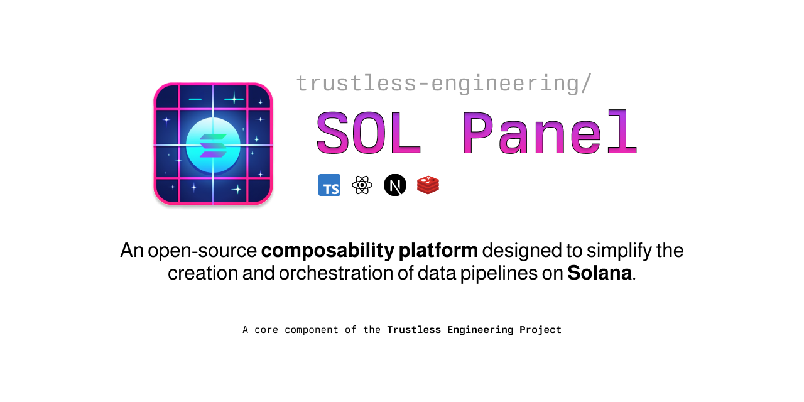

# SOL Panel

 <picture>
  
</picture>

## Description

SOL Panel is an open-source composability platform designed to simplify the creation and orchestration of data pipelines from Solana.

> NOTE: SOL Panel is in it's infancy! Some of the documentation is for very near-future state as we ramp up the project. If something doesn't work quite right, we encourage you to join our [discord](https://discord.gg/xRRKucEMzz) and ask for help!

## Features

- Data Extraction: Connect with a multitude of data sources, including directly to Solana RPC.
- Data Pipelines: Design and manage data pipelines for streamlined data processing and analysis.
- Specialized for Solana: Focused support and tools specifically for the Solana blockchain.
- Low-Code/No-Code System: Utilize a collection of plugins to construct APIs, webhooks, and event streams without the need for extensive coding.

# Installation

Follow these steps to install SOL Panel:

1. Clone the repository:

```bash
git clone https://github.com/trustless-engineering/sol-panel.git
```

2. Change into the directory

```bash
cd sol-panel
```

3. Install pre-requisites

```
yarn
```

# Running

Make sure to copy `./docs/.env.example` to `.env` and change the values appropriately.

```bash
yarn start && open http://localhost:3000
```

Once started, you can set up an RPC node to start streaming `blockSubscribe` messages to your ingestion pipelines via a [dedicated RPC node](https://github.com/trustless-engineering/sol-panel/wiki/Setup-Dedicated-Solana-RPC-Node-as-Data-Source).

# Contributing

Contributions from the community are welcome. If you're interested in contributing, please reach out in our [Discord](https://discord.gg/xRRKucEMzz).

# Sponsors

SOL Panel wouldn't be possible without the massive support we receive from the community. The following organizations are official sponsors of SOL Panel:

<table>
  <tr>
    <td>
      <center>
         <a href="https://www.latitude.sh">
            <picture>
              <source media="(prefers-color-scheme: dark)" srcset="./docs/sponsors/latitudesh-logotype-light.svg">
              
            </picture>
         </a>
      </center>
    </td>
    <td>Latitude.sh provides globally distributed bare-metal servers you can deploy in under 10 minutes, prorated to the second.</td>
    <td><a href="https://www.latitude.sh/r/F221607B">Get started with $200 credit when you use our referral link!</a></td>
  </tr>
</table>

# License

SOL Panel is licensed under the terms of the Apache License 2.0. For more information, please see the [LICENSE](LICENSE) file.

# Contact

If you have any questions, issues, or suggestions, please feel free to open an issue or contact us directly at [solpanel@trustless.engineering](mailto:solpanel@trustless.engineering).
