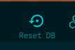

import RequiredVersion from '@site/src/components/RequiredVersion';

## Requirements

SOL Panel has been built with as few core dependencies as possible.
To install and run, you only need a Kubernetes cluster.
To develop, you will need only a few additional tools.
The following is a list of requirements for SOL Panel.

- [Node.js <RequiredVersion component="node" />](https://nodejs.org/en/)
- [Docker](https://www.docker.com/)
- [Tilt <RequiredVersion component="tilt" />](https://tilt.dev) (or higher)

## Recommended Environments

There are various tooling configurations that work with developing on SOL Panel.
Some are better than others, and some can lead to hours of headaches.
We have tested the following environments and recommend them for development.

### Github Codespaces

Github Codespaces allow anyone with a browser to contribute to SOL Panel.
Creating a new Codespace from this branch will provide a fully functional development environment with all of the tools you need to get started.
You can then connect directly to the Codespace from VS Code or your browser.

:::tip Launch SOL Panel Codespace

**_NOTE:_** A codespace with **_4 CPU/8GB RAM_** minimum is highly suggested.

[](https://codespaces.new/trustless-engineering/sol-panel?quickstart=1)

:::

## Setup

When you first clone the repo, you will need to run a few commands to initialize the project, and create your local development environment.
The environment will provide you with a local Kubernetes cluster, a local Docker registry, and a running instance of SOL Panel.
These instructions assume you are using a Mac, but the commands should be similar for other operating systems.

#### Install Requirements

```bash
brew install tilt-dev/tap/ctlptl docker nvm kubectl k9s
```

#### Clone Repo

```bash
git clone https://github.com/trustless-engineering/sol-panel.git && cd sol-panel
```

#### Setup Cluster and Registry

By creating a local docker registry, we can avoid costly pushes to remote registries during development. There is a `cluster.yml` file in the `tilt` directory that will create a Kind cluster and a local registry for you.

```bash
ctlptl apply -f tilt/cluster.yml
```

#### Start SOL Panel

Run `tilt up` to start the application. This will build the Docker image, and start the application.

```bash
tilt up
```

This will start the application and make it available at [`http://localhost:3000`](http://localhost:3000). You can also access the Tilt dashboard at [`http://localhost:10350`](http://localhost:10350).

## Initialze

After running the setup steps, SOL Panel should be available on your local machine at `http://localhost:3000`. You will also find that Postgres, Redis, and Faktory are also running in the cluster and exposed on their relevant ports to your local machine.

From here you can choose to either run the NextJS project locally (useful if you wish to attach debuggers), or you can allow Tilt to automatically sync changes made in the `src` directory into the running container via hot reloading.

### Run Locally

#### Install Dependencies

```bash
pnpm install
```

#### Run Migrations

Running the migrations will ensure the database schema is up to date. The migrations will also seed the database with some initial data to help you get started.

```bash
pnpm prisma db migrate
```

### Run in Cluster

Dependencies are installed automatically in the container during build, so you do not need to install them locally.
You can start modifying the code in the `src` directory, and Tilt will automatically sync the changes into the running container.

#### Run Migrations

When first starting the application, you can press the `Reset DB` button at the top of the Tilt dashboard to run the migrations and seed the database.

<center>



</center>

#### Updates

All updates to files in `src` will be automatically synced into the running container, without the need to rebuild or restart the application.
