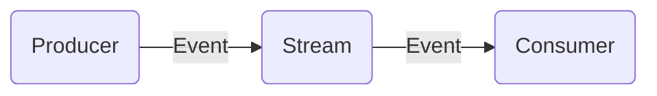
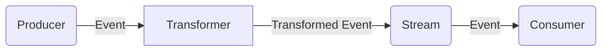

## Summary

Producers are the main ingress point for events into SOL Panel.
Producers can come in all sorts of formats and are primarily sourced from plugins.

### Event Flow

In an extremely simplified view, an event enters a stream like so:

If there are any transformers attached to the producer then SOL Panel runs those in serial prior to adding to the stream:

### Transformers

Producer transformers allow you to modify an event **after** the Producer has created it, but before it's added to the stream.

Transformers are ran **_in serial_** for producers. This ensures that the order in which the transformers are executed is determinstic and that each transformer in the chain can operate on a lock-free event.

Because of this, you should structure your transformer chains to be as small as possible for producers. This is notably different from Consumer transformers as they operate on each event in parallel before sending to the Consumer.

## Default Producers

SOL Panel ships with the following default producers:

- Webhooks
- Script
- Container
- [Dedicated RPC](dedicated-rpc)

### Webhooks

Webhooks are extremely simple. Any message sent to the endpoint will be added to the stream.

### Scripts

Scripts allow you to run arbitrary Javascript/Typescript as a producer.
Various libraries are available during runtime that allow you to run loop comprehensions to produce one or more events.

Scripts have additional configuration that determines when and how the script runs.
You can run a script in the following modes:

- `Continuous` (Restart if process exits)
- `Scheduled` (with regular crontab sytnax)

### Container

For more complex scenarios, you can select any Docker container to run as a producer.
